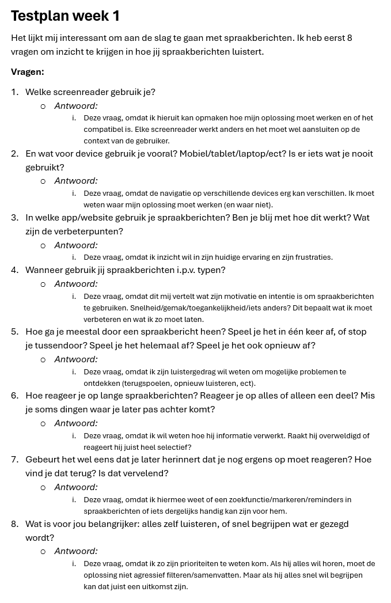
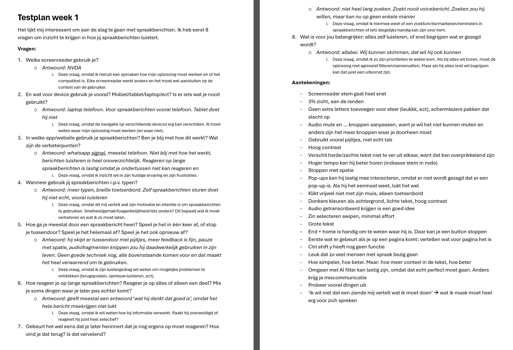
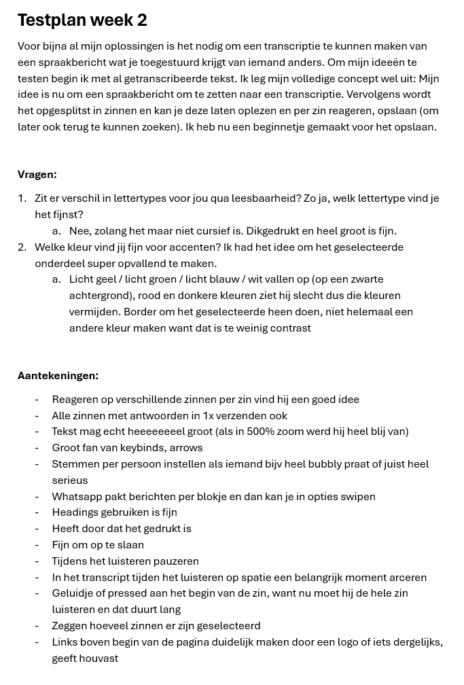

# Human-Centered-Design
Mijn repo voor het vak Human Centered Design

---

# Mijn leerdoelen
- Ik wil leren hoe ik creatieve en speelse interacties kan bouwen met HTML, CSS en JavaScript in plaats van alleen functionele interfaces.
- Ik wil beter worden in experimenteren en niet terughoudend zijn met dingen uitproberen.
- Ik wil beter worden in het vastleggen van iteraties en feedback tijdens het ontwikkelproces.

---

# Mijn voortgang

## Maandag 30/03

### Wat heb ik vandaag gedaan?
Kickoff  
Deze website met de verschillende hoofdstukken gelezen: https://exclusive-design.vasilis.nl/  
Een overzicht gemaakt van dingen om op te letten (bron: https://www.a11y-collective.com/blog/blind-website-accessibility/):  
- Alt-tekst bij afbeeldingen (wat het is én wat het doet duidelijk maken). ‘ ‘ leeg laten voor decoratieve afbeeldingen
- Geen ‘afbeelding van…’, want dat zegt hij automatisch al
-	Keyboard-only navigatie
-	Logische structuur met duidelijke headings
-	Inputs, buttons en links hebben een label nodig of een omschrijving van wat het doet
-	Visuele focus indicators
-	Skip-to-content links aan het begin van de pagina
Testplan opgesteld voor morgen: wat ik wil weten van de testpersoon? + waarom wil ik dit weten?
Vragen voor morgen:  
  
Weekly Geek voorbereid  

### Hoeveel tijd heeft me dat gekost?
-   Kickoff: 1 uur
-   Website lezen: 2 uur
-   Dingen om op te letten: half uur
-   Testplan opstellen: 2 uur
-   Weekly Geek voorbereiden: half uur

### Wat heb ik geleerd?
Exclusive design principles: goede websites zijn niet "one size fits all", ontwerpen voor echte gebruikers maakt websites beter voor iedereen.

### Wat ga ik morgen doen?
Testplan afmaken, prototypes uitwerken en testen

---

## Dinsdag 31/03

### Wat heb ik vandaag gedaan?
Weekly Geek, ideeën gebrainstormed, testplan afgemaakt, getest bij de proefpersoon, checkout  

### Hoeveel tijd heeft me dat gekost?
-   Weekly Geek: 1 uur
-   Testplan afmaken: 2 uur
-   Ideeën bedacht: 1 uur
-   Testen: 2 uur

### Wat heb ik geleerd?
Antwoorden op mijn vragen en héél veel over hoe Berend het web gebruikt.
  

### Wat ga ik morgen doen?
Verschillende opties voor prototypes uitwerken en testen

---

### Voortgangsgesprek 1
Ik heb heel veel inzichten gehaald uit het testen deze week, veel dingen waar ik nog nooit bij stil had gestaan (zie de afbeelding bij Dinsdag 31/03 - Wat heb ik geleerd?). Een paar dingen die me vooral zijn bijgebleven zijn hoe snel hij zijn toetsenbord en screenreader gebruikt, dat hij pop-ups lastig kan navigeren, dat zijn achtergrond donker moet zijn met heel hoog contrast (bijvoorbeeld toepassen dat hetgene waar de screenreader op staat een felle kleur wordt, want ik zag dat hij wel op het scherm keek). Na de test hoorde ik hem nog zeggen: "ik wil niet dat een ziende mij vertelt wat ik moet doen". Ik denk dat dit misschien wel het belangrijkste is waar mijn werk aan moet voldoen, dat is mij heel erg bijgebleven.
Volgende week ga ik verschillende opties aan Berend voorleggen, testen wat werkt en wat niet.

---

## Dinsdag 07/04

### Wat heb ik vandaag gedaan?
Weekly Geek, test voorbereid en getest bij Berend.

### Hoeveel tijd heeft me dat gekost?
-   Weekly Geek: 1 uur
-   Test voorbereiden: tot 12 uur
-   Testen: 1,5 uur
-   Readme updaten: half uur

### Wat heb ik geleerd?
Feedback op mijn test. Wat me vooral is bijgebleven is dat hij inzoomt tot 500%, dus de tekst moet écht heel groot. Hij zou het fijn vinden om tijdens het luisteren een stuk te kunnen arceren met de spatie toets, ik ga kijken of ik hier iets mee kan.

### Wat ga ik de volgende les doen?
Verder werken met nu echt het uiteindelijke prototype bouwen.

---

### Voortgangsgesprek 2
Niet te moeilijk denken met buttons, laat tekst als tekst, list items, ect. Checkboxes kunnen misschien handig zijn voor de zinnen. Idee laten zien is belangrijker dan dat het helemaal werkend is. Focussen op de volgende test, niet op het eindproduct. Ik ga me nu vooral focussen op het laten zien van mijn idee i.p.v. het helemaal perfect werkend maken. Alle aantekeningen die ik heb genomen tijdens de tests ga ik proberen te verwerken voor de laatste test.

---

## Maandag 20/04

### Wat heb ik vandaag gedaan?
Borders om de elementen heen gezet, kleuren aangepast, geluidje toegevoegd, zoeken in de antwoorden aangepast naar zoeken in alles en de voiceover functionaliteit verbeterd.

### Hoeveel tijd heeft me dat gekost?
-   Opmaak: tot 12u
-   Functionele aanpassingen: 3 uur

### Wat heb ik geleerd?
Ik heb meer geleerd over hoe je om moet gaan met aria labels voor screenreader functionaliteit en javascript.

### Wat ga ik de volgende les doen?
Laatste keer testen