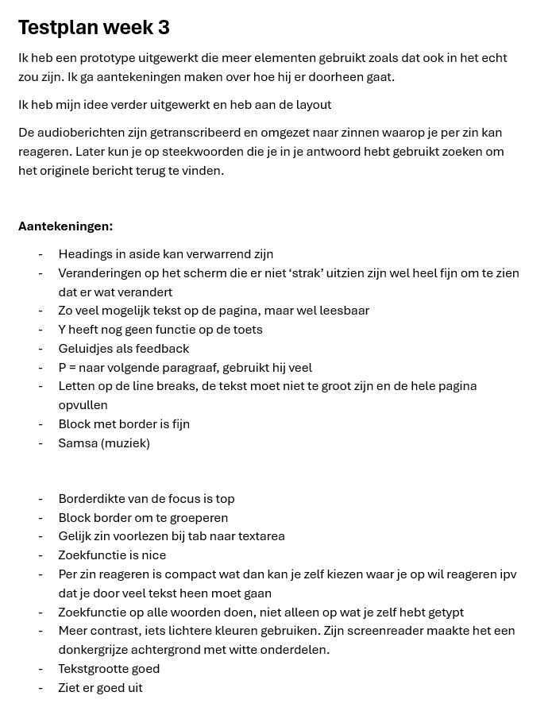
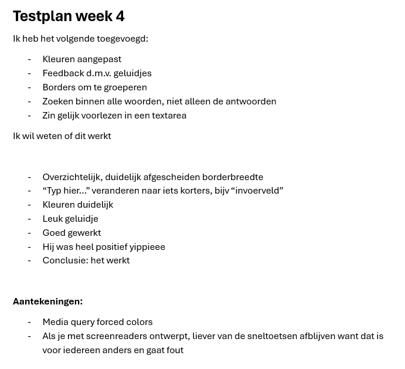

# Human-Centered-Design
Mijn repo voor het vak Human Centered Design. Ik heb gedurende 4 weken gewerkt aan het maken van een prototype voor Berend, een blinde man die een screenreader gebruikt. Ik heb gedurende het vak met hem samengewerkt en zijn feedback gebruikt om mijn prototype te verbeteren. Voor dit vak heb ik geleerd om te ontwerpen met de gebruiker centraal, en niet vanuit mezelf. Dat heeft echt mijn kijk op design veranderd. Ik heb me bezig gehouden met een manier uitwerken waarmee hij makkelijker kan reageren en zoeken in spraakberichten. Het spraakbericht wordt getranscribeerd en opgesplitst per zin, hierdoor kan hij per zin zijn antwoord geven en opslaan. Ook heb ik een zoek functionaliteit toegevoegd waarmee hij makkelijker zijn antwoorden op de verschillende zinnen terug kan vinden. Door de constante feedback van Berend heb ik mijn idee continu kunnen aanpassen en verbeteren, zodat het zo goed mogelijk aansluit bij zijn behoeften en wensen.

---

# Mijn leerdoelen
- Ik wil leren hoe ik creatieve en speelse interacties kan bouwen met HTML, CSS en JavaScript in plaats van alleen functionele interfaces.
- Ik wil beter worden in experimenteren en niet terughoudend zijn met dingen uitproberen.
- Ik wil beter worden in het vastleggen van iteraties en feedback tijdens het ontwikkelproces.

---

# Mijn voortgang

## Maandag 30/03

### Wat heb ik vandaag gedaan?
Kickoff  
Deze website met de verschillende hoofdstukken gelezen: https://exclusive-design.vasilis.nl/  
Een overzicht gemaakt van dingen om op te letten (bron: https://www.a11y-collective.com/blog/blind-website-accessibility/):  
- Alt-tekst bij afbeeldingen (wat het is én wat het doet duidelijk maken). ‘ ‘ leeg laten voor decoratieve afbeeldingen
- Geen ‘afbeelding van…’, want dat zegt hij automatisch al
-	Keyboard-only navigatie
-	Logische structuur met duidelijke headings
-	Inputs, buttons en links hebben een label nodig of een omschrijving van wat het doet
-	Visuele focus indicators
-	Skip-to-content links aan het begin van de pagina
Testplan opgesteld voor morgen: wat ik wil weten van de testpersoon? + waarom wil ik dit weten?
Vragen voor morgen:  
  
Weekly Geek voorbereid  

### Hoeveel tijd heeft me dat gekost?
-   Kickoff: 1 uur
-   Website lezen: 2 uur
-   Dingen om op te letten: half uur
-   Testplan opstellen: 2 uur
-   Weekly Geek voorbereiden: half uur

### Wat heb ik geleerd?
Exclusive design principles: goede websites zijn niet "one size fits all", ontwerpen voor echte gebruikers maakt websites beter voor iedereen.

### Wat ga ik morgen doen?
Testplan afmaken, prototypes uitwerken en testen

---

## Dinsdag 31/03

### Wat heb ik vandaag gedaan?
Weekly Geek, ideeën gebrainstormed, testplan afgemaakt, getest bij de proefpersoon, checkout  

### Hoeveel tijd heeft me dat gekost?
-   Weekly Geek: 1 uur
-   Testplan afmaken: 2 uur
-   Ideeën bedacht: 1 uur
-   Testen: 2 uur

### Wat heb ik geleerd?
Antwoorden op mijn vragen en héél veel over hoe Berend het web gebruikt.
  

### Wat ga ik morgen doen?
Verschillende opties voor prototypes uitwerken en testen

---

### Voortgangsgesprek 1
Ik heb heel veel inzichten gehaald uit het testen deze week, veel dingen waar ik nog nooit bij stil had gestaan (zie de afbeelding bij Dinsdag 31/03 - Wat heb ik geleerd?). Een paar dingen die me vooral zijn bijgebleven zijn hoe snel hij zijn toetsenbord en screenreader gebruikt, dat hij pop-ups lastig kan navigeren, dat zijn achtergrond donker moet zijn met heel hoog contrast (bijvoorbeeld toepassen dat hetgene waar de screenreader op staat een felle kleur wordt, want ik zag dat hij wel op het scherm keek). Na de test hoorde ik hem nog zeggen: "ik wil niet dat een ziende mij vertelt wat ik moet doen". Ik denk dat dit misschien wel het belangrijkste is waar mijn werk aan moet voldoen, dat is mij heel erg bijgebleven.
Volgende week ga ik verschillende opties aan Berend voorleggen, testen wat werkt en wat niet.

---

## Dinsdag 07/04

### Wat heb ik vandaag gedaan?
Weekly Geek, test voorbereid en getest bij Berend.

### Hoeveel tijd heeft me dat gekost?
-   Weekly Geek: 1 uur
-   Test voorbereiden: tot 12 uur
-   Testen: 1,5 uur
-   Readme updaten: half uur

### Wat heb ik geleerd?
Feedback op mijn test. Wat me vooral is bijgebleven is dat hij inzoomt tot 500%, dus de tekst moet écht heel groot. Hij zou het fijn vinden om tijdens het luisteren een stuk te kunnen arceren met de spatie toets, ik ga kijken of ik hier iets mee kan.

### Wat ga ik de volgende les doen?
Verder werken met nu echt het uiteindelijke prototype bouwen.

---

### Voortgangsgesprek 2
Niet te moeilijk denken met buttons, laat tekst als tekst, list items, ect. Checkboxes kunnen misschien handig zijn voor de zinnen. Idee laten zien is belangrijker dan dat het helemaal werkend is. Focussen op de volgende test, niet op het eindproduct. Ik ga me nu vooral focussen op het laten zien van mijn idee i.p.v. het helemaal perfect werkend maken. Alle aantekeningen die ik heb genomen tijdens de tests ga ik proberen te verwerken voor de laatste test.

---

## Maandag 13/04
Thuis de test voor morgen voorbereid.

---

## Dinsdag 14/04

### Wat heb ik vandaag gedaan?
Derde test gedaan. Daarna heb ik op school nog even verder gewerkt aan mijn blog.

### Hoeveel tijd heeft me dat gekost?
-   Testen: 2 uur

### Wat heb ik geleerd?

Ik ga een border gebruiken om elementen te groeperen, zorgen dat de bijbehorende zin automatisch wordt voorgelezen als de textarea focus heeft, de zoekfunctie aanpassen op alle woorden i.p.v. alleen op de antwoorden en ik ga de kleuren iets aanpassen zodat het beter zichtbaar is voor hem.

### Wat ga ik de volgende les doen?
Feedback verwerken in de 4e test.

---

## Maandag 20/04

### Wat heb ik vandaag gedaan?
Borders om de elementen heen gezet, kleuren aangepast, geluidje toegevoegd, zoeken in de antwoorden aangepast naar zoeken in alles en de voiceover functionaliteit verbeterd.

### Hoeveel tijd heeft me dat gekost?
-   Opmaak: tot 12u
-   Functionele aanpassingen: 3 uur

### Wat heb ik geleerd?
Ik heb meer geleerd over hoe je om moet gaan met aria labels voor screenreader functionaliteit en javascript.

### Wat ga ik de volgende les doen?
Laatste keer testen

---

## Dinsdag 21/04

### Wat heb ik vandaag gedaan?
Laatste dingen afgemaakt van mijn prototype en toen getest.

### Hoeveel tijd heeft me dat gekost?
-   Afronden: 1 uur
-   Testen: 2 uur

### Wat heb ik geleerd?

Hij was heel positief over wat ik had gemaakt, daar ben ik heel blij mee.

### Wat ga ik de volgende les doen?
Om de puntjes op de i te zetten ga ik "Typ hier..." veranderen naar iets korters. Ik ga ook nog reflecteren op hoe ik aan de exclusive design principes heb gewerkt.

---

### Voortgangsgesprek 3
Test nog even hoe de list items onderaan de pagina worden opgelezen, misschien een async functie maken die zegt 'ul bevat x aantal list items'.
Ik heb de kleuren van zijn instellingen nagemaakt zodat hij dat niet nog extra aan hoeft te zetten.

---

### Reflectie op exclusive design

Tijdens dit vak heb ik gewerkt met de vier exclusive design principes ([exclusive-design.vasilis.nl](https://exclusive-design.vasilis.nl/)). In plaats van te ontwerpen vanuit mijn eigen aannames, heb ik echt samen met Berend ontworpen. Hij is blind en gebruikt een screenreader en zijn toetsenbord om over het web te navigeren. Dit is hoe ik de principes heb toegepast:

1. **Study situation**  
   Voordat ik begon met coderen, ben ik eerst gaan kijken hoe Berend eigenlijk het web gebruikt. Bij de eerste test zag ik al dingen die ik echt niet had verwacht: hij zoomt in tot wel 500%, hij gaat super snel door pagina's heen met zijn toetsenbord (zijn screenreader staat zo snel dat ik het niet eens kan verstaan), zijn scherm staat op dark mode met enorm veel contrast, en hij kan nog een beetje zien, waardoor hij toch wel naar het scherm kijkt. Visuele dingen maken dus wel degelijk uit. Als ik dit niet had geweten, had ik waarschijnlijk iets gebouwd wat voor hem totaal onbruikbaar zou zijn.

2. **Ignore conventions**  
   Ik heb geleerd dat je soms de 'standaard' regels van het web los moet laten als dat beter werkt voor je gebruiker. Zo heb ik bijvoorbeeld geen pop-ups gebruikt, want dat is voor Berend super irritant navigeren. Ook heb ik de tekst veel groter gemaakt en duidelijke randen gebruikt om dingen te groeperen. Achtergrondkleurtjes en witruimte werken voor hem namelijk een stuk minder goed dan harde borders. Ook heb ik het zo gemaakt dat de bijbehorende zin direct wordt voorgelezen zodra hij in een tekstvak staat, zodat hij niet de hele tijd heen en weer hoeft. Dat is misschien niet hoe het hoort volgens de boekjes, maar voor hem werkt het wel het best.

3. **Prioritise identity**  
   Ik wilde Berend niet zien als een 'proefkonijn', maar meer als iemand met wie ik samen dit project maak. Wat hij na de eerste test zei bleef echt hangen: "Ik wil niet dat een ziende mij vertelt wat ik moet doen." Dat heeft best wel indruk op me gemaakt en de rest van mijn ontwerp beïnvloed. Ik heb geprobeerd zijn feedback elke week meteen mee te nemen in mijn nieuwe versies. Zo is het echt een product voor hem geworden.

4. **Add nonsense**  
   Om het niet alleen maar een saaie, functionele tool te maken, heb ik ook een geluidje toegevoegd om het wat speelser en menselijker te maken. Omdat ik dit voor Berend ontwerp en hij een best wel serieus persoon is, heb ik het niet te gek gemaakt met de nonsense. Het geluidje is subtiel en niet storend. Zo voorkom ik dat ik hem juist irriteer door het toevoegen van te veel nonsense. Het geluidje is alleen te horen na het opslaan van een antwoord, als bevestiging van dat het goed is gegaan.
